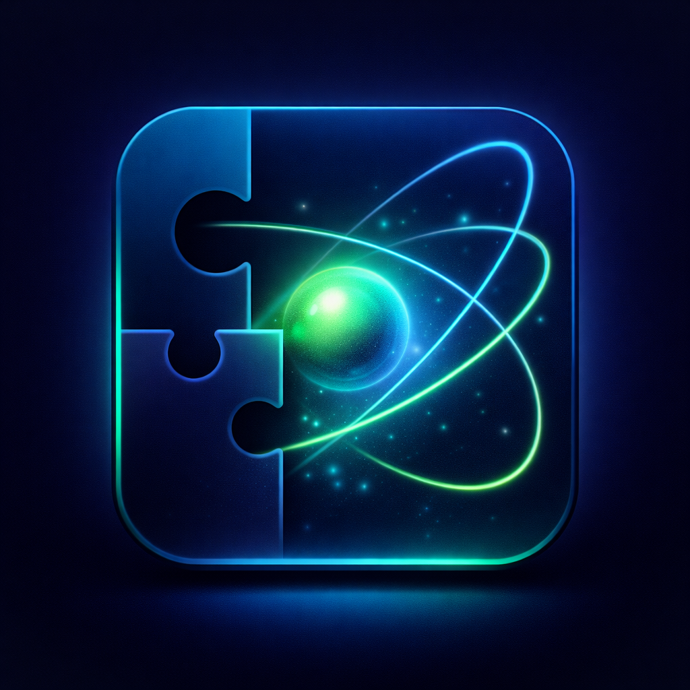

# ⚛️ Periodix — Interactive Periodic Table Game

<p align="center">
  
</p>

<h3 align="center">Learn Chemistry. Solve Puzzles. Master the Periodic Table.</h3>

<p align="center"><em>Put every element in its place.</em></p>

<p align="center">
  <strong>Periodix</strong> is an interactive, game-based learning experience designed to make mastering the periodic table faster, more visual, and more enjoyable.
</p>

<p align="center">
  ⚛️ 118 elements · 🎮 6 levels · ☁️ 0 servers
</p>

<p align="center">
  <a href="https://periodix.me/">🌐 Live Demo</a>
  •
  <a href="https://github.com/Sherozabdulghaffar/Periodic-Table-visual-learning/issues">🐛 Report a Bug</a>
</p>

---

## ✨ What is Periodix?

Learning the periodic table can feel like memorizing hundreds of disconnected facts.

**Periodix takes a different approach.**

Instead of simply reading a static table, learners interact with elements through puzzles and timed challenges. The goal is to turn repetition and memorization into an engaging learning experience.

> 🧪 **Chemistry + 🎮 Game-based Learning + 🧠 Memory + ⚡ Speed**

---

## 🚀 Features

### 🧩 Interactive Periodic Table Puzzle

Practice the periodic table by interacting directly with the elements and placing them into their correct positions.

### ⏱️ Speed Challenges

Test how quickly you can recognize and organize elements while working against the clock.

### 🏆 Downloadable Results Card

Complete all six levels and download a results card with your name, score, level, accuracy, and the time you completed it in — drawn entirely in the browser and saved as a PNG. No server, no account.

### 📊 Per-Player Results History

Every finished run is stored in your browser: score, accuracy, completion time, and date. The results modal lists your past runs per player name, so you can watch your scores climb run after run.

### 🧪 Built-in Chemistry Tutor

Periodix includes ORION, a local chemistry tutor that answers questions about elements, groups, how to play, and memory tricks — all from a knowledge base bundled with the site, with no servers involved.

### 📱 Modern Web Experience

Built as a browser-based application with a responsive interface so learners can access it without installing a desktop application.

### 🔎 Search-Friendly

The project includes SEO metadata, Open Graph information, structured data, a sitemap, and a canonical website URL to make the educational resource easier to discover.

---

## 🔄 How the Game Loop Works

Each run is one pass around the table — twenty elements at a time, six levels in total. Here's the loop:

```text
   ┌────────────────────┐
   │ NAME + DIFFICULTY  │
   │ (easy / med / hard)│
   └─────────┬──────────┘
             ▼
   ┌────────────────────┐        ▲  next level?
   │ SHUFFLE 20 TILES   │        │
   │ INTO THE TRAY      │        │
   └─────────┬──────────┘        │
             ▼                   │
   ┌────────────────────┐        │
   │ DRAG A TILE TO ITS │        │
   │ SLOT               │        │
   └─────────┬──────────┘        │
             ▼                   │
   ┌────────────────────┐        │
   │       DROP?        │        │
   │ correct ► clicks in│        │
   │ wrong ► shakes &   │        │
   │        counts acc. │        │
   └─────────┬──────────┘        │
             │ all 20 placed     │
             ▼                   │
   ┌────────────────────┐        │
   │   LEVEL COMPLETE   ├────────┘
   └─────────┬──────────┘
             │ level 6 done
             ▼
   ┌────────────────────┐
   │  RESULTS CARD +    │
   │  DOWNLOAD +        │
   │  HISTORY           │
   └────────────────────┘
```

1. **Name & difficulty** — enter your name and pick Easy, Medium, or Hard (this adjusts the clock).
2. **Shuffle** — the next twenty elements (eighteen on the final level) land shuffled in the tray below the board.
3. **Drag & drop** — drag each tile to its slot. A wrong drop rattles the tile and counts against your accuracy; a right drop clicks it into place and scores points.
4. **Level up** — place every tile to move to the next level. Six levels cover all 118 elements.
5. **Results** — after the final level, download your results card (score, level, accuracy, time) and watch it appear in your per-player history.

---

## 🎯 Why Periodix?

Traditional periodic tables are excellent references, but they aren't necessarily engaging learning environments.

Periodix focuses on **active learning**:

| Traditional Approach | Periodix                        |
| -------------------- | ------------------------------- |
| 📖 Read the table    | 🎮 Interact with it             |
| 🧠 Memorize          | 🧩 Practice                     |
| ⏳ Passive learning   | ⚡ Timed challenges              |
| 📋 Static reference  | 🏆 Progress-oriented experience |
| 🔁 Repetition        | 🎯 Game-based repetition        |

The goal isn't to replace textbooks or teachers — it's to provide another tool students can use alongside them.

---

## 🌐 Try Periodix

### 👉 [Launch Periodix](https://periodix.me/)

No installation is required. Open the website and start learning.

---

## 🛠️ Built With

Periodix is intentionally built using lightweight web technologies:

* **HTML5** — Application structure
* **CSS3** — Styling, layout, animations, and responsive design
* **JavaScript** — Game logic, local tutorial knowledge base, and canvas results cards
* **JSON** — Configuration and application data
* **GitHub Pages / any static host** — Public deployment (no server required)
* **Google Analytics** — Optional website analytics

---

## 🚫 Backend-Free by Design

Periodix is **fully client-side** — there is no server, no API key, and no account system. Everything runs in the visitor's browser:

* **Chat & tutorials** — ORION answers from the bundled knowledge base in `tutorials.js`. No network calls, works offline.
* **Results cards** — drawn on an HTML canvas and downloaded as a PNG image, right from the browser.
* **Game state, player name & results history** — kept in `localStorage` (past runs are saved per player and shown in the results modal).
* **Maintenance mode** — read from the static `site-config.json` file; flip `maintenance.enabled` to `true` to show a maintenance screen with a custom message.

This means the site can be hosted on GitHub Pages, Netlify, Cloudflare Pages, or any static file server — nothing else to deploy or maintain.

## 📁 Project Structure

```text
Periodic-Table-visual-learning/
│
├── index.html              # Periodix landing page
├── periodic.html           # Interactive periodic-table experience
├── chat.html               # ORION tutor interface
├── chat.js                 # Chat page logic (uses the local tutor)
├── tutorials.js            # Built-in chemistry knowledge base (local ORION)
├── chatbot-widget.js       # Floating chat widget (local tutor)
│
├── script.js               # Main application/game logic
├── style.css               # Main styling
│
├── site-config.json        # Site configuration (maintenance mode, etc.)
│
├── logo.png                # Periodix logo
├── logo.svg                # Vector logo
├── favicon.ico             # Browser icon
│
├── sitemap.xml             # Search-engine sitemap
├── robots.txt              # Crawler configuration
└── confetti.browser.min.js # Celebration effects (local, no CDN)
```

---

## 🧑‍💻 Run Locally

Because Periodix is a client-side web project, you can run it locally with a simple static server.

### 1. Clone the repository

```bash
git clone https://github.com/Sherozabdulghaffar/Periodic-Table-visual-learning.git
```

### 2. Enter the project

```bash
cd Periodic-Table-visual-learning
```

### 3. Start a local server

For example, with Python:

```bash
python -m http.server 8000
```

Then open:

```text
http://localhost:8000
```

> Some browser features may behave differently when opening HTML files directly with `file://`. Using a local server is recommended.

---

## 🤝 Contributing

Contributions, suggestions, bug reports, and ideas are welcome.

### How to contribute

1. Fork the repository
2. Create a feature branch

```bash
git checkout -b feature/my-new-feature
```

3. Make your changes
4. Test them locally
5. Commit your changes

```bash
git commit -m "Add my new feature"
```

6. Push your branch

```bash
git push origin feature/my-new-feature
```

7. Open a Pull Request

---

## 💡 Ideas for Future Development

Periodix is an ongoing project. Some areas I would like to explore include:

* 📚 More chemistry learning modes
* 🧠 Additional memory-training exercises
* 🎯 Additional difficulty options beyond Easy / Medium / Hard
* 🏅 Improved achievement and progression systems
* 📊 Cross-device history sync, class leaderboards, and shared progress
* 🧪 A larger built-in tutorial knowledge base
* 🌍 Internationalization and additional languages
* ♿ Improved accessibility
* 📱 Further mobile optimization
* 🧪 More chemistry-focused quizzes and challenges

---

## 🔓 Open Source

Periodix is publicly available so developers, students, educators, and other learners can inspect the project, suggest improvements, report issues, and contribute.

The repository was developed privately before being opened to the public and is now being continued as an open-source educational project.

---

## 👨‍💻 Author

**Shahroz**

Creator and maintainer of Periodix.

<p align="center">
  Made with ❤️ for students who want to make chemistry more interactive.
</p>

---

<p align="center">
  <strong>⚛️ Periodix</strong><br>
  <em>Learn the elements. Master the table.</em>
</p>
